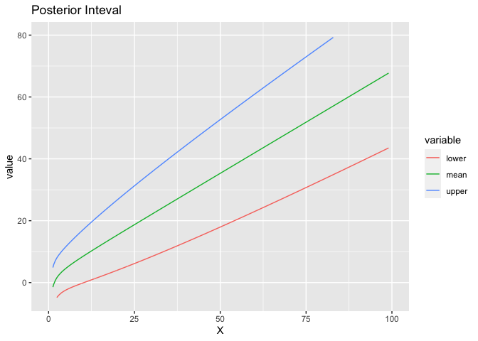

<!-- README.md is generated from README.Rmd. Please edit that file -->

# EBCHS

<!-- badges: start -->

<!-- badges: end -->

EBCHS is a package for the our new paper: An Empirical Bayes Method for
Chi-Squared Data; please see the link:
<https://amstat.tandfonline.com/doi/full/10.1080/01621459.2020.1777137>

## Installation

You can install the development version from
[GitHub](https://github.com/) with:

``` r
# install.packages("devtools")
devtools::install_github("dulilun/EBCHS")
```

## Example

This is a basic example which shows you how to solve a common problem:

``` r
## basic example code
library(reshape2)
library(ggplot2)
library(EBCHS)
##############################################
set.seed(2020)
p = 1000
k = 7
# the prior distribution for lambda
alpha = 2
beta =  10
# lambda
lambda = rep(0, p)
pi_0 = 0
p_0 = floor(p*pi_0)
p_1 = p-p_0
lambda[(p_0+1):p] = rgamma(p_1, shape = alpha, rate=1/beta)
# Generate a Poisson RV
J = sapply(1:p, function(x){rpois(1, lambda[x]/2)})
X = sapply(1:p, function(x){rchisq(1, k+2*J[x])})

############################################
qq_set = seq(0.01, 0.99, 0.01)
out = EB_CS(X, k, qq=qq_set, method='LS', mixture = FALSE)
# plot
E = out$E_lambda
V = out$V_lambda
UP = E+1.645*V^(1/2)
LOW = E-1.645*V^(1/2)

Dat = data.frame(cbind(X, LOW, E, UP))
colnames(Dat)=c('X', 'lower', 'mean', 'upper')


df <- melt(Dat, id="X")
pp = ggplot(df)+geom_line(aes(x=X, y=value, color=variable))+
  labs(title="Posterior Inteval")+ylim(c(-5, 80))+xlim(c(0, 100))
pp
#> Warning: Removed 22 row(s) containing missing values (geom_path).
```


